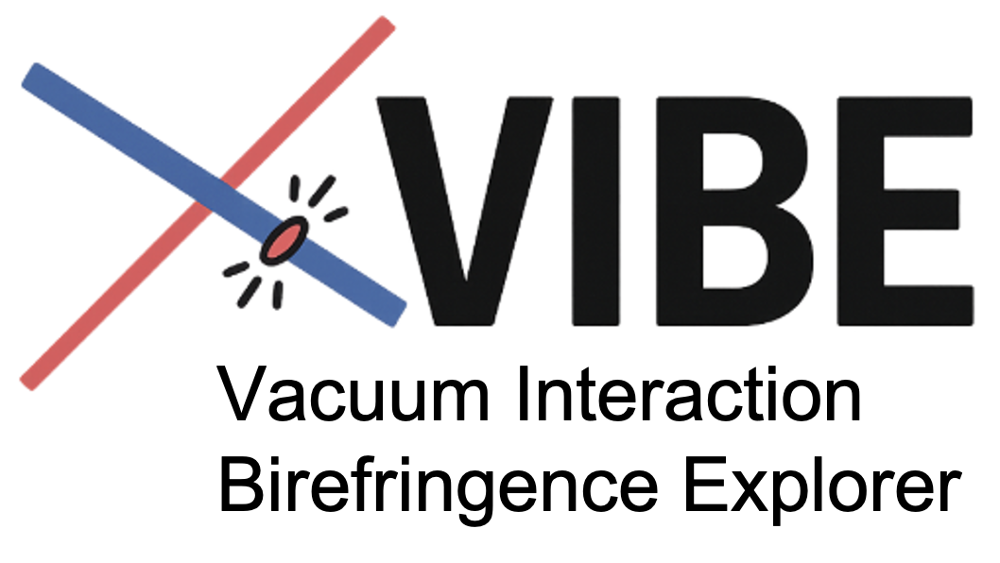

# VIBE
Vacuum Interaction Birefringence Explorer
=======
<p align="center">
  
</p>


## What this project does

**VIBE (Vacuum Interaction Birefringence Explorer)** is a **diffraction-based simulation toolkit** for modelling **quantum-vacuum signals**, in particular **vacuum birefringence**, in **realistic laser–laser and laser–XFEL pump–probe experiments**.

The code extends the **diffractive beam propagation framework LightPipes** by embedding a **quantum-vacuum emission module** directly into the optical propagation pipeline. This makes it possible to simulate, within a *single and self-consistent framework*:

- the **generation** of vacuum birefringence signals at the pump–probe interaction point, and  
- the **subsequent propagation** of both the probe background and the induced quantum-vacuum signal through a **complete experimental beamline**, including lenses, apertures, masks, slits, and detectors.

### Core idea

Instead of treating vacuum birefringence as a purely far-field or analytical effect, VIBE expresses the dominant quantum-vacuum contribution at the probe frequency as a **virtual source field** defined in the interaction plane.  
This source field is constructed from the **local overlap between the pump intensity and the probe field**, and is then propagated using the **same Fresnel diffraction formalism** as any conventional optical field.

As a result, quantum-vacuum signals are handled **on exactly the same footing** as standard diffraction, imaging, and absorption effects.

### What this enables

VIBE allows one to:

- simulate **vacuum birefringence pump–probe experiments** with **experimentally realistic beam profiles**,  
- include **diffraction, absorption, clipping, and aberrations** from optical components,  
- propagate **multiple polarization channels** (probe, VB∥, VB⊥) consistently through the setup,   
- estimate **absolute signal photon numbers** at the detector with moderate numerical cost.


## Citation

If you use **VIBE** in your work, please cite the corresponding paper:

```bibtex
@article{VIBE_placeholder,
  title   = {Simulating vacuum birefringence with a diffractive beam propagation code},
  author  = {Matheron, Aimé and Smíd, Michal and Zepf, Matt and Karbstein, Felix},
  journal = {TBD},
  year    = {TBD},
  doi     = {TBD}
}
```


---

VIBE/
├── src/
│   └── vibe/
│       ├── VIBE.py                # Main simulation engine
│       ├── utils.py               # Generic utilities
│       ├── bash_config.py         # HPC / batch job helpers
│       ├── mmmUtils_v2.py          # Numerical & optical helper routines
│       ├── wavefront_fitting.py   # Wavefront analysis tools
│       ├── regularized_propagation_v2.py
│       ├── rossendorfer_farbenliste.py
│       ├── optical_constants/
│       │   ├── Be.txt
│       │   └── diamond.txt
│       └── Dabam2D/                # 2D surface-defect maps (mirrors / optics)
│
├── VIBE_outputs/                   # All simulation outputs and diagnostics
│   ├── figures/
│   ├── flows/
│   ├── pickles/
│   ├── planes/
│   ├── Lens_diags/
│   └── VB_figures/
│
├── notebooks/                      # Example notebooks
├── yamls/                          # YAML-based simulation templates
├── docs/                           # Documentation assets (logo, figures)
└── pyproject.toml                  # Packaging and dependencies

---

## Simulation workflow (what `main_VIBE` does)

`main_VIBE(params, elements)` orchestrates the entire run:

1. **Initialization**  
   - Creates a LightPipes field with a Gaussian source (`Begin`, `GaussBeam`) using `propsize`, `wavelength`, `N`, beam size and tilts from YAML.  
   - Wraps the field in a **FieldBundle** so additional channels (VB∥, VB⊥) can be carried transparently. The bundle also holds the current **z-position** and flags for **regularized propagation**.

2. **Book-keeping & plotting setup**  
   - Prepares figures, mosaics, “flow” exports, intensity unit selection (`relative` vs `photons`), and stores traces for post-run normalization.

3. **Main loop over elements in z**  
   For each element `(z, name, dict)`:
   - **Propagate** the bundle by `Δz` via FFT Fresnel or regularized propagation. Pixel size and physical window are updated after each hop.  
   - **Apply** the element to **every active channel** in the bundle (`main`, `VB∥`, `VB⊥`) using `apply_element(...)`.  
   - **Create VB channels at TCC (once):** if `name=='TCC'` and `VB_signal: 1`, build VB masks from the IR intensity map and spawn VB∥/VB⊥ fields via masked multiplication.  
   - **Compute intensities** per channel, in requested units, and generate per-plane plots/snapshots. For flows, the Y-axis unit and colorbar label adapt to the selected intensity unit; photon scaling is applied consistently to raw and fixed grids.

4. **Outputs**  
   - Returns updated `params`, a transmission trace, and a dict of figures for saving/export. Flow panels can annotate **shadow factors** (SFA13/SFA75) and mark the detector ROI.

---

## Inside `VIBE.py` — important building blocks

### Field containers & propagation
- **`FieldBundle` dataclass** groups LightPipes fields under channel keys (currently `"main"`, later `"VB_parr"`, `"VB_perp"`), with a shared z-position and regularization flags.  
- **`propagate_bundle(bundle, dz, method)`** advances all channels by the same distance using `Forvard` (FFT) or `Fresnel`, or a **regularized** variant when enabled.

### Optical constants & phase/thickness conversions
- **`get_index(elem, E)`** loads δ, β by **interpolating Henke tables** from `optical_constants/<Elem>.txt`. Results feed the **phase shift per meter** and **absorption coefficient** used to convert thickness maps to transmission/phase maps.
- **`thickness_to_phase_and_transmission(E_eV, delta, beta)`** computes these per-meter conversion factors (phase and exponential attenuation) for a given energy. Used throughout to turn geometry into physics.

### Apertures, lenses, defects → field operators
- **`get_aperture_transmission_map(...)`** builds **binary/analytic transmission maps** for simple shapes (`square`, `rectangle`, `wire`, **`gaussian` blocker**) including super-Gaussian order.  
- **`get_aperture_thickness_map(...)`** builds **thickness maps** for **refractive elements** and complex “wire-like” obstacles (`parabolic_lens`, `streichlens`, `realwire`, `trapez`, `tent`, `par`, `invpar`, `wireslit`, `wire_grating`, etc.), plus orientation and randomization hooks.  
- **`doap(...)`** converts thickness to **transmission** and **phase** maps via δ, β and applies optional profiling, rotation, and diagnostic plotting (1D cuts and 2D views).  
- **`do_phaseplate(...)`** adds **measured CRL defect maps** (Seiboth/Celestre) scaled to the number of lenses and selected material; returns a phase-shift map to apply.  
- **`do_edge_damping_aperture(...)`** creates smooth apodizers to suppress wrap-around/edge artefacts late in the line.

### Element application & regularized propagation
- **`apply_element(bundle, el_name, el_dict, params, reg_prop_dict, ...)`** is the **central dispatcher** that:
  - iterates over active channels;
  - supports **zoomed resampling** (`zoom_window`), **regularize/deregularize** (`reg`, `dereg`, `reg-by-f` thin-lens compensation), and
  - applies **apertures/phaseplates** by multiplying intensity and/or phase maps.

### VB creation at TCC
- **IR profile**: Two options exist — **Airy PSF** for a finite NA focus or a **2-D Gaussian** spot; both normalized to power and converted to **I [W cm⁻²]** given `P_peak` (from pulse energy or direct).  
- **Masks & channels**: Using the analytical prefactors (critical intensity `I_cr`, fine-structure constant and geometry), the code builds **VB∥** and **VB⊥** **intensity masks** at TCC and **spawns the new channels** by multiplying the main field. From that point on, **all channels propagate together**.

### Air scattering (optional, at the detector)
- **`apply_air_scattering_and_debug_plot(...)`** performs a **2-D convolution** of the image with a kernel constructed from **Geant4 particle hits** (either raw 2-D histogram or a **smoothed radial** kernel), with optional transmission scaling and identity-kernel checks. Shapes are transiently **cropped to odd** dimensions to optimize FFT convolution and then restored.  
  Enable on the `Det` plane via YAML switches such as `AirScat: 1`, `use_symmetric_kernel`, `compute_transmission`, etc.

### Plotting & flows
- **Per-plane figures**: phase or intensity per channel; configurable mosaic, zoom, log scaling.  
- **Flow plots**: longitudinal waterfall of vertical cuts, with **unit-aware** colorbars (`photons` → “photons/m²”, else relative/W m⁻²) and profile overlays of the propagated box size. Detector and ROI are annotated; **shadow factors** can be printed on the panel.

---

## Units and normalization

Set `intensity_units` in YAML:

- `photons` → results and flows are scaled to **photons/m²** using the appropriate factors; total-photon integrals are computed consistently and compared to `photons_total` when available.  
- `relative` → legacy normalized units (good for shape comparisons).  
- For some debug paths the code also reports **W cm⁻²** when building the IR intensity.

---

## Typical YAML sketch (abridged)

```yaml
# Beam & run
wavelength: 1.415e-10        # ~8.766 keV
N: 2048
propsize: 5.0e-3
beamsize: 5.0e-6
intensity_units: photons
fig_rows: 2
fig_cols: 3

# Elements (unordered; Launch_VIBE sorts by position)
elements:
  start:
    type: plane
    position: 0.00
    in: 1

  TCC:
    type: plane
    position: 3.50
    VB_signal: 1          # build VB channels here

  L1:
    type: parabolic_lens
    position: 2.40
    size: 400e-6
    roc: 200e-6
    num_lenses: 6
    double_sided: true
    elem: Be
    in: 1

  Det:
    type: plane
    position: 7.00
    in: 1
    AirScat: 1
    use_symmetric_kernel: true
```

---

## Running a simulation

1. **Install** (Python ≥3.9 recommended)

   ```bash
   pip install lightpipes numpy scipy matplotlib astropy pillow scikit-image
   ```

   If you plan to use air-scattering and flows, keep `darkfield/*` available on `PYTHONPATH`.

2. **Launch**

   ```bash
   python Launch_VIBE.py --yaml path/to/your_config.yaml
   ```

   The script will print a summary of parameters, then generate per-plane figures, a flow panel, and optional movie frames/exports depending on your YAML switches.

---

## Tips & switches

- **Regularized propagation**: use `reg`, `dereg`, or `reg-by-f` elements to stabilize long propagation spans with parabola compensation; the propagation mode toggles automatically in the loop.  
- **Edge damping**: enable `edge_damping` to apply a smooth apodizer and reduce ringing/aliasing.  
- **Henke tables**: ensure `optical_constants/<Elem>.txt` exists for all materials referenced in YAML (`elem:`).  
- **Photon accounting**: set `photons_total` in YAML if you want the flow integrals to be checked against a target value near the beam shaper.

---

## How the VB feature works

At **TCC**, the IR pump profile is synthesized as a 2-D **Airy** or **Gaussian** intensity map and converted to **W cm⁻²** using `P_peak` (computed from pulse energy or set directly). Using the standard analytical prefactor (`I_cr`, fine-structure constant, geometry), the code builds two **unitless masks** for **VB∥** and **VB⊥**. Multiplying these masks with the **main** X-ray field **spawns** the two VB channels in the **FieldBundle**. From there, the **same propagation** and **same element stack** apply to all channels, so VB is carried all the way to the detector.

---

